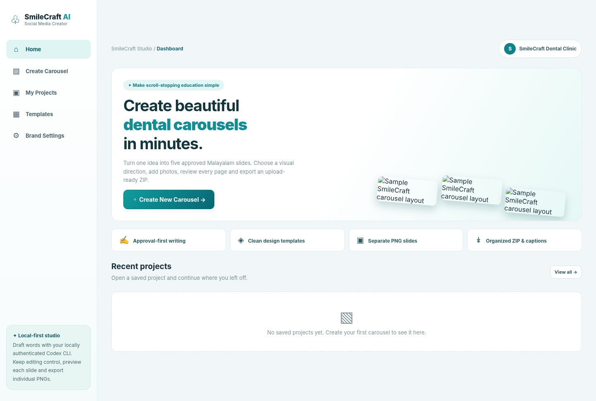

# SmileCraft Carousel Studio

A working **local-first, dependency-free Node.js carousel builder** for SmileCraft Dental Clinic. It follows the workflow: idea → AI-written (or editable starter) copy → per-slide corrections and approval → visual reference and image-provider selection → generated final artwork → review → individual PNGs + captions + editable JSON in a ZIP. Reference cards are supplied to the selected model as visual guidance; the app does not compose final carousel designs from deterministic Canvas templates.



## Quick start

1. **Install Node.js 20 or newer** if not already installed. Extract the ZIP **with hidden files intact**; the `.git/` folder is part of the project.
2. Open a terminal in `smilecraft-carousel-studio` (the folder with `package.json`).
3. Run `npm start` (or `node server/index.mjs`). **No `npm install` is required:** the app has no third-party JavaScript dependencies.
4. Open **http://127.0.0.1:4178** in a recent Chrome, Edge, Safari or Firefox browser.
5. Select **Create Carousel** → enter a topic or choose a suggested one → choose **Generate slide copy** with Codex CLI, or **Start with editable sample** without Codex → edit and approve all five slides → choose a visual reference and image provider → generate and verify all five final images → Review → Export.

To use another port, set `PORT=4200` in your terminal environment. By default the server binds to `127.0.0.1`, not the public Internet.

## Copy-generation providers

**The browser never stores or asks for your Codex login.** Install Codex CLI on the computer where `npm start` runs and authenticate it in your normal terminal. For example, with Node/npm installed:

```sh
npm install -g @openai/codex
codex login
codex --version
npm start
```

Follow the login prompts and confirm CLI access with a simple `codex exec` command in that same terminal environment. The server runs `codex exec` in a temporary, empty working directory using `--sandbox read-only`, `--ephemeral` and `--output-last-message`, then parses/validates its JSON output. The AI drafts **naturally mixed Malayalam-English copy and English visual prompts**: Malayalam words stay in Malayalam script, while English words and dental terms stay in Latin script. It also supports **one-slide revisions from your correction text**. Set the exact clinic name and optional phone number under **Clinic Settings** before generating; those values are passed to drafting/revision and used in slide/caption branding, and a missing phone number is never invented. All AI-generated copy is **unapproved** until you explicitly approve it. If the CLI is not installed or cannot authenticate, the app shows the actual error; you can still use an editable starter and finish the project without Codex. Set `CODEX_BIN` if your executable is named or located differently.

For copy generation and rewrites, choose **Codex CLI, OpenAI API, Gemini API, Antigravity (`agy`), or Claude API** directly in the Topic or Content step. Set `OPENAI_API_KEY`, `GEMINI_API_KEY`, or `ANTHROPIC_API_KEY` for the respective API choices; `agy` and Codex use their local authenticated CLIs.

**Important:** A ChatGPT/Codex login is not the same as an OpenAI API key. The app does not claim that using the CLI makes separately billed image generation free.

## Final artwork providers

The app includes template-reference images and accepts custom PNG/JPEG/WebP references. For every slide it sends the approved heading/body, visual direction, selected reference, exact clinic details, brand colors, and optional logo to one of these providers:

- **OpenAI API:** set `OPENAI_API_KEY`; optional `OPENAI_IMAGE_MODEL` defaults to `gpt-image-2`, and `OPENAI_IMAGE_QUALITY` defaults to `high`.
- **Gemini API:** set `GEMINI_API_KEY`; optional `GEMINI_IMAGE_MODEL` defaults to `gemini-3.1-flash-image`.
- **Codex CLI (experimental):** install/authenticate Codex and ensure its `$imagegen` capability is available. This runs in a temporary workspace and must produce `final-slide.png`.
- **Antigravity CLI (`agy`):** install/authenticate `agy` and ensure its native `generate_image` tool is available. Set `AGY_BIN` if the executable has a custom path; `AGY_IMAGE_TIMEOUT` defaults to `5m`.

Example: `OPENAI_API_KEY='your-key' npm start` or `GEMINI_API_KEY='your-key' npm start`. API keys stay in the server environment and are not stored in the project/browser. API calls may incur provider charges. Codex and Antigravity use their own authenticated CLI quota and availability.

Choose the **Codex writing model** in the Topic or Content step. In the Design step, choose the **image provider** and then one of that provider's supported image models; there are no free-text model fields.

Claude API is available for copy and corrections. Claude supports image understanding but its API returns text rather than a generated raster image, so final slide rendering uses OpenAI, Gemini, Codex image generation, or Antigravity.

Generated artwork is stored per slide. Editing approved copy, changing the selected reference, or changing clinic branding invalidates affected artwork. Image models can still misspell text—especially Malayalam—so Review shows the approved source copy beside the generated image and export remains a human-reviewed step.

## Files and exports

Projects automatically save locally under `storage/projects/` (excluded from Git), plus a **Save** button. From **My Projects**, reopen, delete, or import the `project.json` exported in a previous ZIP. If you want to move the project to another computer, export/import the project JSON and the original image files as necessary. Each carousel ZIP contains:

```text
smilecraft_<topic>/
  01.png ... 05.png       # FIVE separate complete 1080 × 1350 (4:5) PNG images
  instagram_caption.txt   # editable Malayalam-English social copy
  youtube_title.txt
  youtube_description.txt
  project.json            # editable/re-importable backup (optional)
  README.txt
```

Social captions can be edited in the Export step. If you did not generate copy through Codex, the app composes a **draft** caption from your current slide text; review the text before posting. YouTube upload is not automated: export slides as a slideshow video in your preferred editor if you want a Short/video. The app does not upload to Instagram or YouTube.

The selected image provider must be capable of rendering Malayalam glyphs. Even when glyphs render, image models can misspell or alter Malayalam and English text, so compare every generated slide against the approved copy before export.

## Development, tests, and Git

`npm test` runs the Node.js API smoke tests. `npm run dev` runs the backend with Node's watch mode. See `docs/01-dashboard.png` through `docs/05-export.png` for walkthrough screenshots and `docs/sample-export.zip` for a small sample output. The checked-in `.git` directory contains the initial local commit; verify with `git status` and `git log --oneline -1`. To publish **your own repository** if desired, add a new remote and push manually:

```sh
git remote add origin https://github.com/YOUR-USERNAME/YOUR-REPOSITORY.git
git push -u origin main
```

No GitHub remote or account access is preconfigured. Uploaded assets, generated projects and credentials remain on your computer unless you choose to export/publish them. Don't bind this unauthenticated local app to a public host/network. For cloud hosting, add authentication, safe storage, rate limits, security review and a compatible Codex execution/credential model first.

## Known scope limitations

- Provider availability, quota, supported regions and image quality depend on the configured external service or locally authenticated CLI.
- User-uploaded templates are **style references**, not layered editable files or a guarantee of pixel-identical output.
- AI-generated typography must be checked against the approved source copy before publishing.
- No MP4 rendering, automatic publishing, collaboration, or cloud syncing; the ZIP is designed to make manual posting simple.
- Validate any medical information with a licensed dental professional before publishing.
