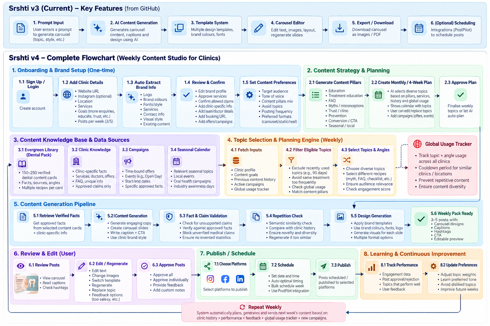
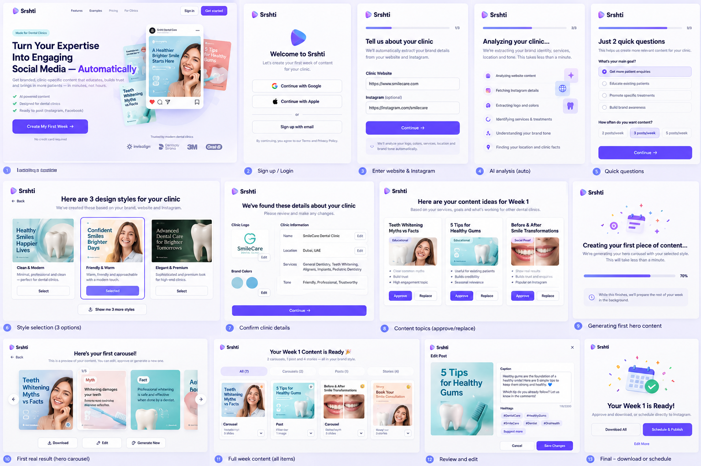
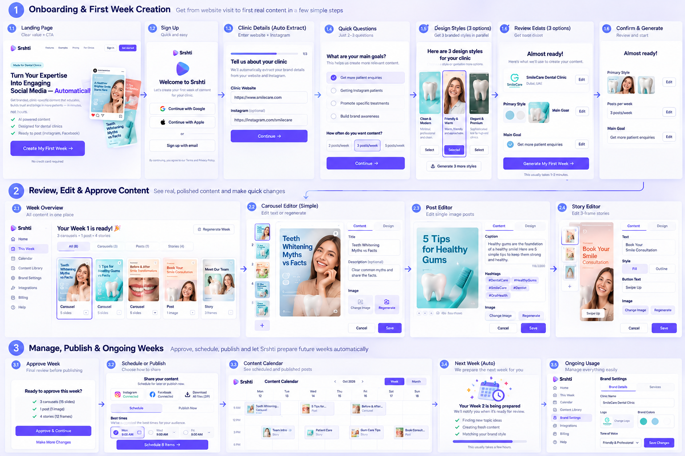
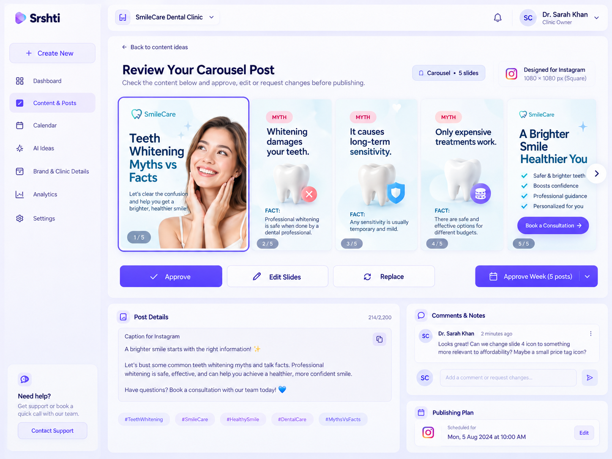
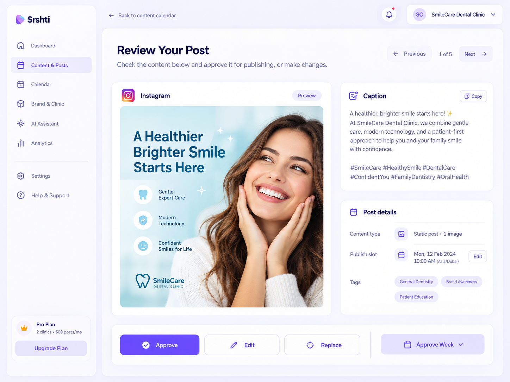
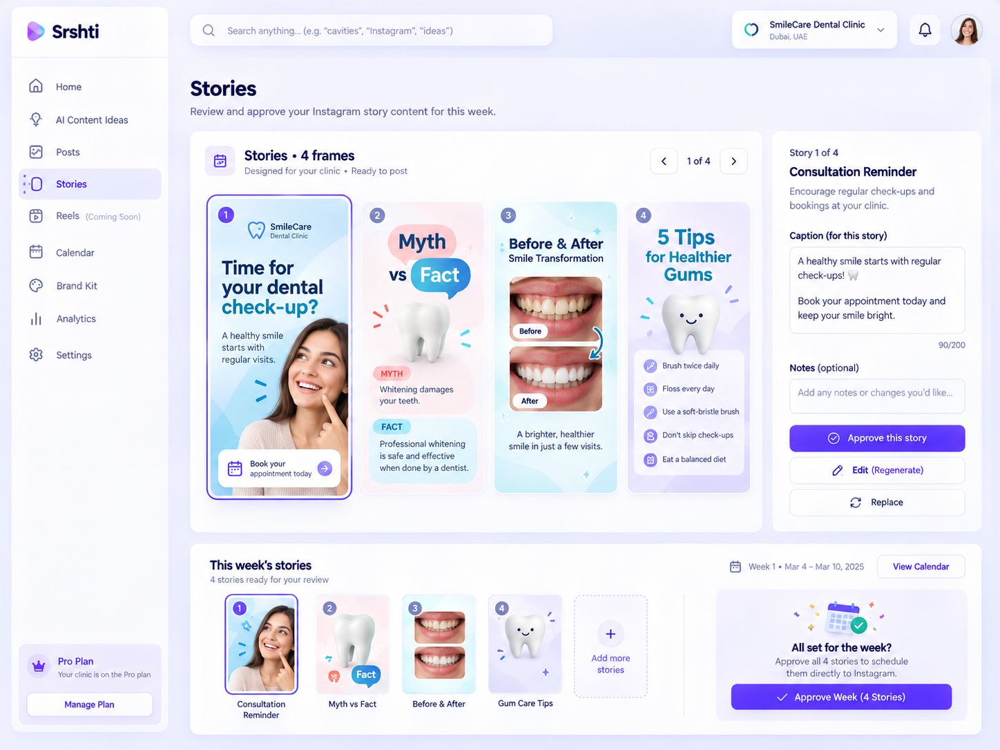
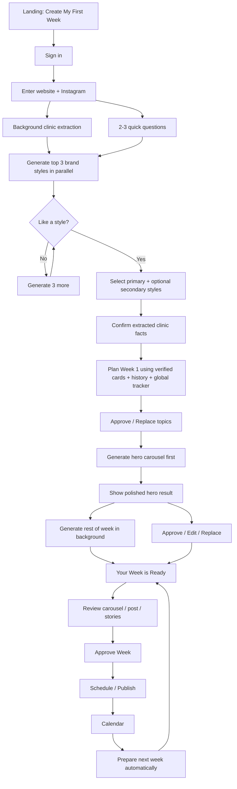

# Srshti V4 — Product, UX & Engineering Handoff

> **Purpose:** This document is the implementation handoff for the V4 rebuild of Carousel Studio / Srshti.  
> **Primary audience:** coding agent / frontend agent / backend agent / product implementation team.  
> **Source baseline:** `ananthcjayan12/smilecraft-carousel-studio` branch `v3`, with the visual language of `ananthcjayan12/approveflow`.

---

## 0. Executive summary

V4 is **not** a generic "prompt → AI carousel" tool.

The product should feel like a **weekly social content studio for clinics**:

> **Set up the clinic once → Srshti plans fresh, verified weekly content → generates branded carousels/posts/stories → clinic reviews in minutes → schedules/publishes.**

The UX must optimize for four things:

1. **Fast first value**
   - Do not wait for a complete weekly pack before showing a result.
   - Generate 3 brand style options in parallel.
   - After style selection, generate **one polished hero carousel first**.
   - Generate the remaining weekly content in the background.

2. **Low cognitive load**
   - No prompt engineering.
   - No complex editor unless the user explicitly presses **Edit**.
   - Default flow is **Approve / Edit / Replace**.

3. **Safe, non-repetitive content**
   - AI must not invent medical claims or randomly choose topics.
   - Use a verified knowledge-card system, clinic facts, clinic history, content recipes, engagement angles, and a global usage tracker.

4. **Performance**
   - V3 appears heavy because it loads too much up front and can include very large generated images.
   - V4 must use optimized thumbnails, lazy loading, route/code splitting, background jobs, caching and progressive result delivery.

---

# 1. Visual references

## 1.1 Complete V4 concept flow



## 1.2 All-page concept storyboard



## 1.3 Recommended user-flow map



## 1.4 Carousel approval page



## 1.5 Static-post approval page



## 1.6 Stories approval page



> These images are **design references**, not pixel-perfect requirements. The implementation should preserve the information hierarchy, simplicity, visual language and interaction model.

---

# 2. Existing V3 capabilities to preserve

The V3 repository already provides useful infrastructure and concepts. Do not throw these away unnecessarily.

### Existing backend / platform
- Cloudflare Worker hosted app
- Google sign-in
- D1 account/client/project metadata
- Private R2 assets
- Cloudflare Queue for generation jobs
- credit/job concepts
- account-scoped/private client data
- AI-provider abstraction
- concurrent image generation
- browser export

### Existing product concepts
- multiple clients
- clinic/dental business pack
- client brand details
- logos and assets
- template/design-system references
- existing 10 clinic design systems
- content drafting/rewrite
- image generation
- per-slide review
- carousel export
- multiple output aspect ratios

### V3 workflow currently resembles

`Client → Project → Topic → Copy → Approve slides → Design → Generate artwork → Review artwork → Export`

### V4 should evolve this into

`Clinic setup → Weekly plan → Verified content selection → Branded generation → Simple weekly review → Schedule/publish → Learn → Repeat`

V4 should feel substantially simpler even if it reuses many V3 backend services.

---

# 3. Product positioning

## Core promise

**"Your clinic's social content is ready every week."**

Avoid leading with:
- AI generation
- prompts
- model/provider choices
- template libraries
- technical generation settings

Lead with:
- fresh weekly content
- content that fits the clinic
- branded creative
- verified/controlled facts
- quick approval
- scheduling

---

# 4. Recommended default weekly package

Initial launch package:

- **2 carousels / week**
- **1 static post / week**
- **3–5 stories / week**
- captions for all content
- suggested CTA
- suggested hashtags
- optional scheduling/publishing

This is the default. Advanced/custom frequency can come later.

---

# 5. Founding pricing

Initial competitive pricing discussed:

- **$9 / month**
- **$90 / year**

Treat this as a **Founding Clinic Price** so future public pricing can increase without changing early-customer pricing.

---

# 6. Design system

V4 should use the visual feel of ApproveFlow.

## 6.1 Base design tokens

Use these as the starting point:

```css
:root {
  --bg: #f6f7f9;
  --surface: #ffffff;
  --surface-2: #f3f4f7;
  --surface-3: #eaecf1;
  --border: #e4e7ec;
  --border-strong: #d0d5dd;

  --text: #0d1220;
  --text-2: #454d5f;
  --text-3: #667085;

  --brand: #5b5bd6;
  --brand-hover: #4d4dc7;
  --brand-active: #4343b8;
  --brand-soft: #eef0ff;
  --brand-soft-2: #e0e3ff;
  --brand-text: #4646c1;

  --brand-gradient:
    linear-gradient(135deg, #7474f2 0%, #5b5bd6 46%, #7a4fe0 100%);

  --radius-sm: 8px;
  --radius: 10px;
  --radius-md: 12px;
  --radius-lg: 16px;
  --radius-xl: 22px;

  --shadow-xs: 0 1px 2px rgba(16,24,40,.05);
  --shadow-sm: 0 1px 2px rgba(16,24,40,.06), 0 1px 3px rgba(16,24,40,.08);
  --shadow-md: 0 4px 10px -2px rgba(16,24,40,.08),
               0 2px 4px -2px rgba(16,24,40,.06);

  --font: "Inter", ui-sans-serif, system-ui, -apple-system,
          BlinkMacSystemFont, "Segoe UI", sans-serif;
}
```

## 6.2 Design principles

- light/off-white app background
- white surfaces
- subtle lavender/indigo accents
- very limited shadow depth
- large whitespace
- rounded cards
- avoid dense toolbars
- one obvious primary action per view
- destructive/advanced actions visually secondary
- onboarding should be centered and distraction-free
- app review area can use sidebar navigation

## 6.3 Responsive philosophy

Desktop is the primary operator experience, but clinic approval must be excellent on mobile.

On mobile:
- review one content item at a time
- sticky bottom actions: **Approve · Edit · Replace**
- carousel slides swipe horizontally
- story previews use native vertical proportions
- "Approve Week" should always be reachable without returning to desktop

---

# 7. Primary information architecture

Recommended app navigation after onboarding:

1. **Home / This Week**
2. **Calendar**
3. **Content Library**
4. **Brand**
5. **Integrations**
6. **Settings / Billing**

Do **not** expose AI-provider/model selection in the normal clinic UI.

---

# 8. Complete first-time onboarding flow

The onboarding flow must produce a real polished result quickly.

## Step 1 — Landing page

Primary CTA:

**Create My First Week**

Show:
- polished example content
- 3 benefits maximum
- simple weekly promise
- founding price if useful

Avoid feature grids above the fold.

### Success action
User clicks CTA.

---

## Step 2 — Sign in

Preferred:
- Google
- Apple
- email fallback

After authentication, immediately continue onboarding. Do not send the user to an empty dashboard.

---

## Step 3 — Clinic source input

Ask only:

- Clinic website URL
- Instagram URL/handle (optional)

CTA:

**Continue**

### As soon as Continue is pressed, start parallel background work:

1. crawl/extract clinic website
2. retrieve allowed public Instagram metadata if available
3. detect logo
4. detect brand colors
5. extract clinic name/location
6. extract services
7. extract contact/booking info
8. extract existing messaging/tone
9. prepare clinic fact candidates
10. begin ranking suitable design references

Do not make the user wait on this screen.

---

## Step 4 — Quick questions while extraction runs

Ask only 2–3 questions.

### Question A — Main goal
Examples:
- Get more patient enquiries
- Educate existing patients
- Promote specific treatments
- Build brand awareness

### Question B — Preferred emphasis
Optional:
- select treatment/service to prioritize

### Question C — Weekly frequency
Default:
- 3 feed items / week
- stories generated alongside

Keep this screen click-only wherever possible.

---

# 9. Brand design selection

## Critical rule

Do **not** show all 10 existing Srshti designs at once.

Use the existing 10 design systems as **reference families**.

### First round
Select the 3 most appropriate references using:
- clinic brand colors
- specialty
- audience
- clinic positioning
- stated goal
- existing website visual identity

Generate **3 clinic-adapted design systems in parallel**.

Each output should be a genuinely polished clinic-specific adaptation:
- clinic logo
- clinic colors
- appropriate typography
- relevant imagery
- clinic tone
- dental/clinic specialty
- coherent layout

### UI
Show 3 cards:

- Style A
- Style B
- Style C

Actions:
- **Select**
- **Show me 3 more**

Do not generate the next 3 until requested.

### Selection model

User chooses:
- **1 Primary style**
- optionally 1–2 secondary styles

Do not randomly choose styles later.

Store explicit style roles:

```ts
type ClinicStyleSelection = {
  primaryStyleId: string;
  secondaryStyleIds: string[];
};
```

### Assignment rules

Example:

- Educational carousel → primary
- Service/promotion → secondary A
- Story/engagement → secondary B
- If only primary exists → use primary with layout variants

The planner can rotate style variants, but should never ignore the clinic's selected style family.

---

# 10. Clinic facts confirmation

After style generation is underway or complete, show a lightweight confirmation screen.

Display:
- clinic name
- logo
- colors
- location
- services
- booking URL/contact
- tone
- any important clinic-specific claims

User can:
- confirm
- edit individual fields

Do not show a giant form unless editing.

### Medical safety rule

Clinic facts should have states:

```ts
type FactStatus = "verified" | "imported" | "unverified";
```

Only verified/approved facts may be used as hard factual claims in published copy.

---

# 11. Content engine — V4 core

The AI must **not** invent the weekly topic from scratch.

## 11.1 Knowledge cards

Cards provide verified source material, not finished posts.

Example schema:

```ts
type KnowledgeCard = {
  id: string;
  vertical: "dental";
  topic: string;
  serviceTags: string[];
  pillar: string;
  verifiedFacts: string[];
  prohibitedClaims: string[];
  sources: SourceRef[];
  engagementAngles: EngagementAngle[];
  suitableFormats: ("carousel" | "post" | "story")[];
  lastReviewedAt: string;
};
```

## 11.2 Cards must also be socially interesting

Each card needs engaging angles such as:

- myth vs fact
- common mistake
- surprising question
- patient FAQ
- relatable symptom/situation
- before-you-book checklist
- what-to-expect
- comparison
- do/don't
- timeline
- seasonal relevance
- "what patients commonly ask"
- misconception correction

The card should contain **facts + possible social angles**, not dry textbook copy.

---

# 12. Global Usage Tracker

Required V4 feature.

Purpose:
- prevent the same topic/angle appearing repeatedly across multiple clinics
- reduce obvious cross-client duplication
- preserve novelty

Suggested schema:

```ts
type GlobalContentUsage = {
  id: string;
  knowledgeCardId: string;
  angleId: string;
  recipeId: string;
  clinicId: string;
  region?: string;
  generatedAt: string;
  publishedAt?: string;
};
```

## Selection penalties / cooldowns

Example:
- same clinic + same knowledge card: 90-day cooldown
- same clinic + same angle: 45-day cooldown
- same region + same topic/angle: lower selection weight for 2–4 weeks
- same exact recipe+topic combination across all active clinics: strongly penalize recent reuse

This is a ranking system, not necessarily an absolute ban.

---

# 13. Clinic-local history

Also track what each clinic has already seen/published.

```ts
type ClinicContentHistory = {
  clinicId: string;
  contentId: string;
  knowledgeCardId: string;
  angleId: string;
  recipeId: string;
  styleId: string;
  headline: string;
  embedding?: number[];
  status: "generated" | "approved" | "published" | "rejected";
  createdAt: string;
};
```

Use history to avoid:
- repeated topics
- repeated hooks
- repeated visual style sequence
- repeated CTAs
- repeated treatment emphasis

---

# 14. Weekly topic planning

Once onboarding data is confirmed, generate Week 1 plan.

Inputs:

- clinic services
- clinic goal
- selected treatment emphasis
- content pillars
- verified knowledge cards
- clinic-specific facts
- current campaigns
- seasonal/local relevance
- clinic content history
- global usage tracker
- content-format needs
- style selection

### Default weekly mix

- Carousel 1 → educational / myth / FAQ
- Carousel 2 → treatment/service / comparison / patient journey
- Static post → trust / promotion / clinic-specific message
- Stories → reminders, polls, FAQs, bite-size education, campaign support

### Topic proposal UI

Show 3 feed-content cards.

Each gets:
- topic
- content type
- one-line angle
- why it was selected (optional, subtle)

Actions:
- **Approve**
- **Replace**

Avoid exposing prompting.

---

# 15. First-result strategy

This is important for conversion.

After topic approval:

## Do not generate the entire week before showing anything.

Generate in this order:

### Priority 1
One **hero carousel**.

- copy generation
- fact check
- style application
- all carousel slides generated concurrently where provider allows

### Priority 2
As soon as hero carousel is complete:
- route user directly to the polished review screen
- celebrate subtly
- allow Approve/Edit/Replace

### Priority 3
In background:
- second carousel
- static post
- stories
- captions
- schedule suggestions

The user should be reviewing the first real polished asset while the rest of the week continues.

---

# 16. Content-generation safety pipeline

For each item:

1. Select knowledge card
2. Select engagement angle
3. Select recipe
4. Retrieve allowed verified facts
5. Merge allowed clinic facts
6. Generate structured copy
7. Run unsupported-claim validator
8. Reject/regenerate if unsupported claims exist
9. Run duplicate/semantic-similarity check
10. Reject/regenerate if too close to clinic history
11. Choose assigned visual style
12. Generate visual
13. Save optimized image variants
14. Present for review

### Numeric-claim rule

AI must not invent:
- statistics
- percentages
- prices
- treatment durations
- outcome/success claims
- guarantees

Numbers require an explicitly stored approved/source fact.

---

# 17. Weekly review — overall screen

Primary screen after generation:

**Your Week Is Ready**

Filters/tabs:
- All
- Carousels
- Posts
- Stories

Each card shows:
- thumbnail
- type
- scheduled day/time if present
- approval status

Clicking opens the appropriate review experience.

Global actions:
- **Approve Week**
- optionally **Regenerate Week** hidden under more-options

Do not make users open a complex editor to approve normal content.

---

# 18. Carousel review flow

Reference:


## Layout
- slide strip / horizontal preview
- all slides visible enough to understand sequence
- selected slide larger
- caption below or alongside
- minimal metadata

## Primary actions
1. **Approve**
2. **Edit Slides**
3. **Replace**

### Edit
Open simple side panel/modal:
- text
- caption
- image replacement/regeneration
- maybe style variant

Do not expose advanced graphic-editing controls by default.

---

# 19. Static-post review flow

Reference:


The static-post review page should be simpler than carousel review.

Show:
- large image
- caption
- publish slot
- basic tags/content category

Actions:
- **Approve**
- **Edit**
- **Replace**

One image = one decision.

---

# 20. Stories review flow

Reference:


Stories need their own interaction.

Show:
- vertical story previews
- selected story large
- remaining story frames as neighboring cards/thumbnails
- clear position indicator

Actions per story:
- **Approve**
- **Edit**
- **Replace**

Also provide:
- **Approve All Stories**

Stories do not need long feed captions; support lightweight text/notes where relevant.

---

# 21. Approve-week flow

Once all required content is approved:

Display a simple summary:

```text
Ready to approve this week?

✓ 2 carousels
✓ 1 static post
✓ 4 stories
```

Primary:
**Approve & Continue**

Secondary:
**Make More Changes**

After approval, go to scheduling.

---

# 22. Scheduling / publishing

Simple first version:

Show destinations:
- Instagram
- Facebook
- optional LinkedIn later
- Download ZIP

Show recommended posting slots.

User can:
- accept suggested schedule
- change date/time
- Publish Now
- Schedule

Primary CTA:
**Schedule Week**

Do not require the user to manually schedule every slide/story unless they want advanced control.

Reuse the PostPilot-style publishing infrastructure where sensible.

---

# 23. Calendar

Calendar is a management view, not the main creation flow.

Show:
- scheduled
- approved
- published
- draft
- generation status

Views:
- Week
- Month

Click content → open review/detail.

Avoid a complex social-media-manager UI initially.

---

# 24. Recurring weekly UX

After onboarding, the normal weekly flow must be dramatically shorter:

```text
Notification / login
       ↓
"Your new week is ready"
       ↓
Review feed content
       ↓
Approve / Edit / Replace
       ↓
Review stories
       ↓
Approve Week
       ↓
Schedule / Publish
```

Goal:
**Clinic spends only a few minutes reviewing**, not creating.

---

# 25. Learning loop

Track:

- approved topics
- rejected topics
- approved styles
- replacement reasons
- edit patterns
- preferred content pillars
- preferred treatment emphasis
- preferred tone
- preferred CTA
- posting performance if platform metrics are available

Use feedback to adjust selection weights.

Do not let performance metrics automatically override medical/brand rules.

---

# 26. Feedback reasons

When user clicks Replace, optionally ask with one-tap chips:

- Too similar to previous content
- Not relevant
- Too salesy
- Too generic
- Wrong service
- Don't like this design
- Already posted this
- Other

Do not require feedback; it should never block Replace.

---

# 27. V3 performance problem to avoid in V4

V3 can feel slow because:
- large application surface loads up front
- multiple API resources are fetched on initial load
- potentially very large generated images (7–8 MB each)
- several previews/assets can be present simultaneously
- heavy images can dominate transfer, decode and rendering time

Example:
5 × 8 MB images = ~40 MB before considering JS/CSS/API payloads.

This is unacceptable for the V4 review dashboard.

---

# 28. V4 performance requirements

## 28.1 Generated image storage

Keep the original master in R2 if needed, but always create serving variants:

- thumbnail: ~320–480 px wide
- review preview: ~800–1200 px
- export/original: full resolution

Preferred serving format:
- AVIF where supported
- WebP fallback
- PNG only when required for export/transparency

### Practical target
Normal UI preview assets should preferably be around **200–500 KB**, not 7–8 MB.

---

## 28.2 Never put large image data into JSON

Do not store/send:
- base64 image data
- data URLs in project payloads

Store:
- R2 object key
- metadata
- variant URLs / signed/account-scoped asset endpoint

---

## 28.3 Lazy-load media

Initial dashboard:
- load only above-the-fold thumbnails

Review view:
- load selected image immediately
- prefetch next/previous content
- load full-resolution only on explicit export/zoom if required

Use:
```html

```

Use responsive `srcset`/variants.

---

## 28.4 Code splitting

V4 frontend should not behave like a giant monolithic script.

Split:
- marketing/landing
- onboarding
- dashboard
- content review
- editor
- calendar
- settings

Editor code should not download on the landing page.

---

## 28.5 API loading

Avoid V3-style "fetch all workspace data immediately".

For each screen, fetch only what that screen needs.

Examples:

Home:
- clinic summary
- current week summary

Review:
- one week
- preview metadata

Calendar:
- requested date range

Library:
- paginated content

---

## 28.6 Background jobs

Expensive work must use jobs/queues:
- website extraction
- style generation
- weekly generation
- image conversion
- exports

UI receives:
- job state
- partial results
- progress

Prefer SSE/WebSocket if already practical; otherwise lightweight polling is acceptable.

---

## 28.7 Progressive result order

Use this priority:

1. clinic metadata
2. 3 design styles
3. Week 1 topic plan
4. hero carousel
5. second carousel
6. static post
7. stories
8. optional exports/publishing preparation

This improves perceived speed without showing low-quality placeholders.

---

# 29. Recommended V4 frontend structure

Example:

```text
apps/web/src/
  app/
    router.tsx
    shell/
  pages/
    Landing/
    Auth/
    Onboarding/
      ClinicSourceStep.tsx
      GoalsStep.tsx
      StyleSelectionStep.tsx
      ClinicConfirmStep.tsx
      TopicPlanStep.tsx
      HeroGenerationStep.tsx
    Dashboard/
    WeekReview/
    CarouselReview/
    StaticPostReview/
    StoriesReview/
    Calendar/
    Brand/
    Integrations/
    Settings/
  components/
    ContentCard/
    ReviewActions/
    StyleCard/
    LoadingProgress/
    MediaPreview/
  api/
  hooks/
  stores/
  styles/
    tokens.css
    app.css
```

A React/Vite implementation is preferred for V4 maintainability.

---

# 30. Suggested backend domain modules

Keep one Cloudflare application initially; microservices are unnecessary.

```text
cloudflare/
  auth/
  clinics/
  brands/
  knowledge/
  planning/
  content-history/
  global-usage/
  generation/
  jobs/
  assets/
  publishing/
  billing/
```

---

# 31. Suggested data model

## Clinic

```text
id
account_id
name
website_url
instagram_handle
location
goal
posting_frequency
status
created_at
```

## ClinicBrand

```text
clinic_id
logo_asset_id
primary_color
secondary_colors_json
tone
booking_url
phone
approved_services_json
approved_facts_json
```

## ClinicStyle

```text
id
clinic_id
reference_design_id
role            // primary | secondary
generated_reference_asset_id
version
active
```

## KnowledgeCard

```text
id
vertical
topic
pillar
facts_json
prohibited_claims_json
engagement_angles_json
format_support_json
sources_json
reviewed_at
```

## WeeklyPlan

```text
id
clinic_id
week_start
status
approved_at
scheduled_at
```

## ContentItem

```text
id
weekly_plan_id
knowledge_card_id
angle_id
recipe_id
type            // carousel | post | story
status
style_id
caption
cta
scheduled_at
```

## ContentFrame

```text
id
content_item_id
position
copy_json
asset_id
approval_state
```

## ClinicContentHistory
As described earlier.

## GlobalContentUsage
As described earlier.

## GenerationJob

```text
id
clinic_id
weekly_plan_id
content_item_id
job_type
priority
status
progress
input_revision
error
created_at
started_at
finished_at
```

---

# 32. Key API ideas

Illustrative only:

```http
POST /api/onboarding/analyze
GET  /api/onboarding/:jobId

POST /api/clinics/:clinicId/styles/generate
GET  /api/clinics/:clinicId/styles

PUT  /api/clinics/:clinicId/style-selection
PUT  /api/clinics/:clinicId/profile

POST /api/clinics/:clinicId/weeks/plan
GET  /api/clinics/:clinicId/weeks/:weekId

POST /api/weeks/:weekId/generate
POST /api/content/:contentId/approve
POST /api/content/:contentId/replace
PUT  /api/content/:contentId

POST /api/weeks/:weekId/approve
POST /api/weeks/:weekId/schedule
```

---

# 33. Generation-job priority

The queue should support priority.

Recommended:

```text
P0 user-visible:
- selected style generation
- hero carousel generation
- user-requested replacement

P1 current week:
- remaining carousels
- static posts
- stories

P2 background:
- next week planning
- extra style options
- thumbnails
- analytics enrichment
```

A background job must never delay the user-requested hero result.

---

# 34. Content-style assignment

Do not randomly assign the selected styles.

Recommended deterministic strategy:

```ts
function chooseStyle(item, clinicStyles, recentHistory) {
  // 1. honor format-specific affinity
  // 2. default to primary
  // 3. use a secondary when it improves variety
  // 4. avoid same style repeatedly if secondary exists
  // 5. never use an unselected style
}
```

Examples:
- educational carousel → primary
- promotional/service carousel → primary or secondary A
- static trust post → secondary A
- stories → secondary B or primary story variant

---

# 35. Design-reference generation

Existing 10 Srshti templates remain valuable, but they are **reference systems**, not user-selectable universal templates.

V4 flow:

```text
10 master Srshti reference systems
        ↓
rank for clinic
        ↓
pick top 3
        ↓
adapt each to clinic identity
        ↓
show real clinic-branded versions
        ↓
user selects favorite
```

On "Show me 3 more":
- generate next-ranked 3
- keep previously generated options
- avoid duplicates

---

# 36. Landing-page implementation

Hero should immediately communicate outcome.

Possible structure:

### Headline
**Your clinic's social content, ready every week.**

### Subhead
Srshti plans, designs and prepares fresh clinic-specific carousels, posts and stories — ready for your approval.

### CTA
**Create My First Week**

### Proof / visual
Use polished actual carousel/post/story output.

### Supporting bullets
- Verified clinic-focused content
- Designed in your brand
- Review in minutes

Avoid generic AI wording above the fold.

---

# 37. Empty states

Never present an empty "dashboard" immediately after signup.

Good:
> We're learning your clinic. Your first styles are being prepared.

Bad:
> No projects yet. Create a project.

V4 is not project-management-first.

---

# 38. Error recovery

Any generation failure should be localized.

Examples:
- one slide fails → retry only that slide
- one story fails → rest of weekly pack remains usable
- style generation fails → keep other completed style options
- provider timeout → preserve job and allow retry

Never restart the entire week because one asset failed.

---

# 39. Editing principles

V4 editing should be progressive disclosure.

## Default
No editor.

## Edit pressed
Show only:
- headline/text
- caption
- image change/regenerate
- CTA
- selected style variant

## Advanced later
- layout
- typography
- asset positioning

Do not ship a Canva clone in the first V4 release.

---

# 40. Content review states

Recommended:

```text
planning
generating
ready_for_review
approved
scheduled
published
needs_attention
```

For carousel frames:
```text
draft
generated
approved
replaced
```

Keep the user-facing labels friendlier:
- Creating
- Ready
- Approved
- Scheduled
- Published
- Needs attention

---

# 41. Analytics for the first release

Do not overbuild analytics.

Initial:
- posts created
- approved
- scheduled
- published
- weekly consistency

Later, if social-platform APIs provide reliable data:
- reach
- saves
- shares
- engagement
- clicks

Analytics must not block V4 launch.

---

# 42. Product metrics to instrument

Track funnel events:

```text
landing_cta_clicked
signup_completed
clinic_source_submitted
clinic_analysis_completed
style_options_ready
style_selected
topics_ready
topics_approved
hero_content_ready
hero_content_approved
week_ready
week_approved
schedule_completed
subscription_started
```

Performance events:

```text
time_to_clinic_analysis
time_to_style_options
time_to_hero_result
preview_asset_bytes
page_js_bytes
largest_contentful_paint
```

---

# 43. Success criteria

## First-use success
A new clinic can:
- enter website
- answer minimal questions
- select from 3 real branded styles
- confirm facts
- approve topics
- see a real polished carousel
without learning a complex product.

## Weekly success
Returning clinic can:
- open "Your Week"
- approve/edit/replace
- schedule
in a few minutes.

## Content-quality success
- no unsupported medical claims
- no obvious topic repetition
- no obvious cross-clinic duplicate cadence
- copy feels social, not textbook-like

## Performance success
- app shell loads quickly
- initial screens do not download full-resolution generated assets
- thumbnails are optimized
- background generation never blocks navigation
- no multi-megabyte image needed for ordinary list/review thumbnails

---

# 44. Implementation order

## Phase 1 — Foundation
- React/Vite V4 shell
- ApproveFlow-style design tokens
- route splitting
- auth reuse
- clinic profile model
- optimized asset serving

## Phase 2 — Onboarding
- website/Instagram source screen
- extraction job
- quick goals
- fact confirmation
- style-generation flow
- 3-style selection + "Show me 3 more"

## Phase 3 — Content engine
- knowledge-card model
- engagement angles
- recipes
- clinic history
- global usage tracker
- topic planner
- unsupported-claim checker
- duplicate detector

## Phase 4 — Hero generation
- Week 1 topic approval
- hero-first prioritized generation
- background weekly generation
- partial-result handling

## Phase 5 — Review UX
- week overview
- carousel review
- static-post review
- stories review
- simple editors
- approve/replace flows

## Phase 6 — Scheduling
- approve week
- calendar
- integrations
- publish/schedule

## Phase 7 — Billing / growth
- $9/mo and $90/year founding plan
- checkout
- subscription status
- conversion instrumentation

---

# 45. Agent implementation checklist

Before declaring V4 finished, verify:

### Onboarding
- [ ] Sign-in does not lead to empty dashboard
- [ ] Website extraction starts immediately
- [ ] Quick questions happen while work runs
- [ ] First 3 styles generate in parallel
- [ ] "Show me 3 more" is lazy/on-demand
- [ ] selected style roles persist

### Content
- [ ] AI only receives allowed factual source material
- [ ] unsupported medical claims are blocked
- [ ] knowledge cards include engagement angles
- [ ] clinic content history works
- [ ] global usage tracker works
- [ ] repeated topic/angle combinations are penalized
- [ ] semantic duplicate check exists

### Generation
- [ ] hero carousel has queue priority
- [ ] hero result is shown before full week finishes
- [ ] remaining week continues in background
- [ ] partial failures are recoverable

### Review
- [ ] carousel review is visually optimized
- [ ] static post review is simpler
- [ ] stories have vertical review UX
- [ ] Approve/Edit/Replace are always obvious
- [ ] editing uses progressive disclosure
- [ ] whole week can be approved

### Performance
- [ ] no 7–8 MB assets loaded in list/dashboard UI
- [ ] thumbnails/preview variants exist
- [ ] AVIF/WebP used where sensible
- [ ] images lazy-load
- [ ] full originals load only when required
- [ ] no base64 image payloads in normal JSON
- [ ] frontend routes are code split
- [ ] APIs are screen-scoped, not "load everything"
- [ ] background jobs do not block the UI

### Scheduling
- [ ] schedule suggestions exist
- [ ] user can change time
- [ ] publish/schedule state visible
- [ ] calendar reflects status

---

# 46. Scope guardrails

Do **not** let V4 expand into these before the core loop works:

- full Canva-style editor
- dozens of industries
- complex analytics suite
- dozens of social networks
- public template marketplace
- AI-model/provider picker for clinic users
- advanced automation builder
- complicated agency permissions

The V4 launch loop is:

> **Clinic → brand → styles → verified weekly topics → polished content → quick review → schedule → repeat.**

Everything else is secondary.

---

# 47. Final canonical user flow



---

# 48. Developer notes about V3 → V4 migration

The V3 Cloudflare architecture is still sensible:
- Worker
- D1
- R2
- Queue

The biggest change should be **domain flow + frontend architecture + asset strategy**, not necessarily infrastructure.

Recommended approach:
- keep account/auth/storage foundations
- create V4 data migrations
- introduce weekly plans/content items/history/global usage
- move UI from the monolithic V3 interaction model into route/component modules
- retain provider adapters
- retain concurrency controls
- retain useful design-reference machinery
- replace project-first UX with weekly-content-first UX

---

# 49. Handoff summary for implementation agent

If there is any ambiguity, prioritize in this order:

1. **Simple clinic experience**
2. **Real polished output early**
3. **Verified/non-hallucinated content**
4. **Fresh/non-repetitive content**
5. **Fast performance**
6. **Easy review**
7. **Background automation**
8. **Advanced flexibility**

The clinic should never feel like it is operating an AI design tool.

It should feel like:

> **"I opened Srshti, my content was ready, I checked it, and I approved my week."**
