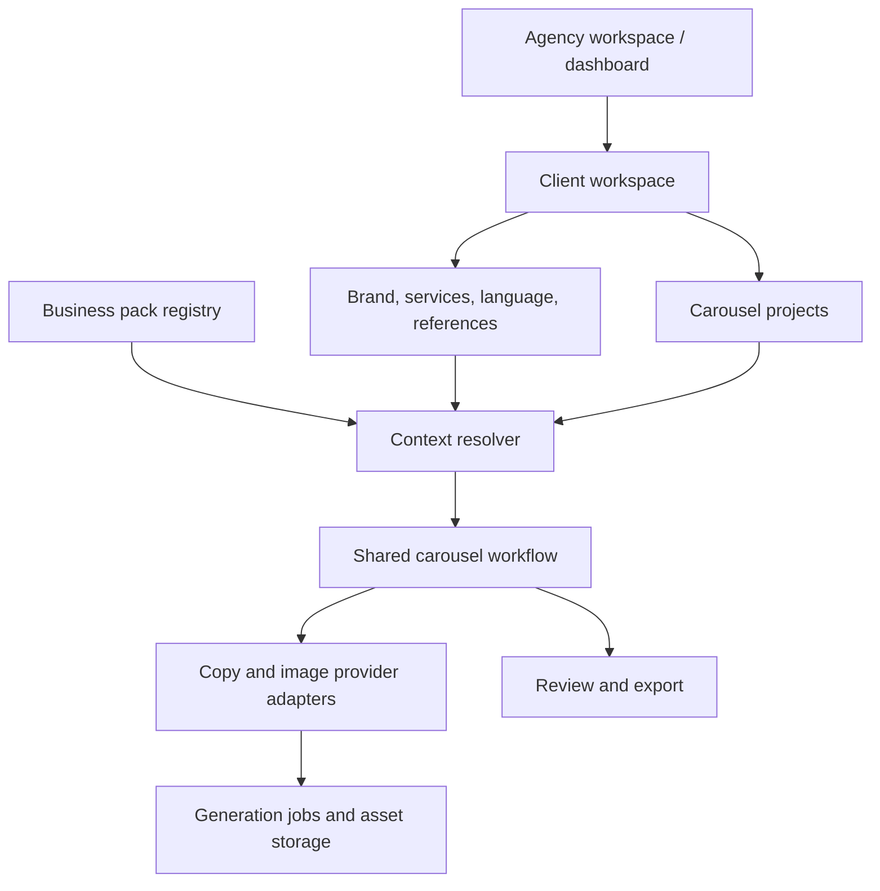

# Multi-business Carousel Studio — proposed high-level design

Status: proposal for review; no application changes implemented.

## Direction

Build one agency workspace that manages multiple clients. Each client selects a business pack, maintains its own brand and reference library, and creates projects through the existing approval-first carousel workflow.

Initial assumption: your team operates the studio for clients. Clients do not need their own logins in the first release. Keep local operation initially; shared online access is a separate deployment milestone.

## Current architecture and implications

- `web/app.js` combines navigation, project editing, branding, and generation orchestration. Extend it into workspace, client, and studio modules without requiring a frontend framework rewrite.
- `web/data.js` contains dental topics, starter slides, fixed slide roles, default SmileCraft identity, and dental captions. These belong in a dental business pack or the existing client's profile.
- `server/codex.mjs` contains the dental writing instructions. `server/image-providers.mjs` contains dental imagery and appointment CTA instructions. Both must consume the same resolved business context.
- `server/index.mjs` stores flat project JSON files, accepts exactly five slides, has no client ownership model, and installs templates into a shared asset directory.
- `web/design-systems.js` and `web/template-pack.js` expect ten named boards and a clinic logo. Replace this fixed import contract with a versioned pack manifest while retaining legacy import support.
- Preserve provider adapters, shared provider concurrency limits, per-slide corrections, copy approval, generated artwork review, and ZIP export.

## Logical architecture



Use a modular Node application with clear boundaries for clients, packs, templates, projects, generation, and exports. Separate services or a microservice deployment are unnecessary for the initial scope.

## Three configuration layers

1. **Business pack:** reusable industry knowledge, onboarding fields, sample topics, starter copy, carousel recipes, CTA defaults, content rules, and compatible template collections.
2. **Client profile:** exact identity, logo, colors, contact details, services, audience, locations, language, tone, approved business facts, and private references.
3. **Project:** topic, campaign-specific facts, recipe, selected reference, approved copy, artwork, captions, and review state.

Client preferences override pack defaults; explicit project choices override client defaults. Required content rules remain enforced. Save a resolved context snapshot and pack/template versions with every project so future settings changes do not silently change old work.

## Business packs and content recipes

| Pack | Additional onboarding information | Example five-slide recipe | Default final CTA |
|---|---|---|---|
| Clinic — dental initially | Specialty, treatments, approved clinical messaging | Hook → explanation → impact → care advice → CTA | Book a consultation |
| Tour operator | Destinations, trip types, inclusions, booking contact | Destination hook → highlights → itinerary → package details → CTA | Enquire about this trip |
| Salon | Services, specialties, booking details | Desired look → service → benefits → care tips → CTA | Book a session |
| Construction | Services, service area, project types, verified portfolio | Client need → approach → process → verified work → CTA | Request a quote |
| General business | Services/products, audience, preferred action | Hook → offering → benefits → details → CTA | Contact us |

The existing clinic pack is specifically dental. Other clinic specialties need appropriate starter content and rules rather than inheriting dental claims.

A pack can offer several recipes, such as education, service promotion, FAQ, offer, and project showcase. Start with five slides and 4:5 output for all packs to preserve the tested pipeline. Model roles and CTA placement in the recipe rather than hardcoding “Science” or “Book an Appointment” in the engine.

Never fabricate prices, dates, treatment outcomes, testimonials, completed projects, or package inclusions. Missing campaign facts should remain editable requirements or be omitted. A pack can supply a checklist for its reviewer.

## Reference templates: retain the proven approach

Keep master design boards plus per-slide crops as image-generation references. New businesses receive curated boards using the same method; they do not automatically acquire usable templates just by changing a label.

Each template has an ID, version, display name, compatible packs/recipes, slide count, aspect ratio, board asset, and crop metadata. Library scope is either shared or private to a client. Client logos are independent assets, never mandatory files inside every template pack.

Preserve the existing ten clinic boards. Mark references with embedded client branding as belonging to that client until a neutral variant is prepared; sample logos must not become another client's identity. Private uploads must not overwrite shared boards or another client's files. Generic references are available as a fallback.

## Uploadable template ZIP packs — first-release feature

Design images externally, package them as a ZIP, and upload during onboarding or later from Templates & Assets. New packs can contain any number of templates within documented upload limits; the ten SmileCraft filenames are not required.

Import flow: **Upload ZIP → Preview templates → Choose business/client and map slides → Install pack → Select a default**.

Support both arrangements:

- **Master boards:** one image per five-slide design, matching SmileCraft. Preview all five crops and allow their boundaries to be adjusted before installation.
- **Individual slide references:** one folder per design containing `01.png` through `05.png`, also accepting JPEG/WebP. Map each image directly to its slide position.

An optional `pack.json` manifest specifies pack ID, name, version, compatible business types/recipes, template names, image paths and slide/crop mappings. Provide a downloadable sample ZIP and packing guide. Example:

```text
salon-templates.zip
  pack.json                 # Optional
  elegant/
    01.png
    02.png
    03.png
    04.png
    05.png
  modern-board.png          # Five-slide board
```

For image-only ZIPs, suggest names from filenames and let the user confirm board versus individual-slide format, grouping, order and crops. Generate the manifest internally; users need not write JSON. Ambiguous mappings require confirmation. Recognize existing SmileCraft ZIPs using their known filenames and crop metadata. An optional packaged logo can be explicitly assigned to the selected client; importing templates must not silently replace branding.

Packs default to **private to the selected client**, with an explicit option to share with selected business types. Track ownership and versions. Detect repeat imports; changed packs install as a new version or separate pack after preview rather than overwriting references. Existing projects retain their original template versions and assets.

Support ZIP STORE and DEFLATE compression so ordinary Finder/Windows archives work. Validate image signatures, dimensions, five-slide completeness, crop bounds, manifest paths, duplicate entries, archive/expanded size and entry count. Ignore `.DS_Store` and `__MACOSX`; reject unsafe paths and unsupported executable content. Stage and validate before atomic installation, leaving the library unchanged on failure. Report actionable errors by file/template.

This importer is shared across all business types. ZIPs contain visual references and metadata; industry writing rules remain separately managed business-pack configuration.

## Easy onboarding

1. **Choose business:** pick type and optional specialty; receive sensible defaults.
2. **Add identity:** business name, logo, contact details, location/service area, brand colors.
3. **Describe the business:** services, audience, language, tone, and a short description; show only the fields relevant to its pack.
4. **Choose visual style:** pick recommended boards, upload individual references, or import a template ZIP; preview and save a default.
5. **Review and create:** review the profile and choose a suggested first topic to open the existing studio.

Only name and business type are essential to create a draft client. Save onboarding progress, allow optional fields to be skipped, and require missing campaign details only when that campaign needs them. AI suggestions remain editable and cannot invent business facts. Providers are configured once at workspace level, with optional per-client defaults.

## Dashboard and navigation

Global navigation: **Overview · Clients · All Projects · Shared Templates · Workspace Settings**.

The overview shows client count, recent projects, work awaiting copy/artwork review, active/failed generation jobs, and Add Client/Create Carousel actions. Search and filter by client, business type, and project status.

Opening a client shows **Projects · Brand & Business · Templates & Assets · Settings**. Keep the active client's name/logo visible throughout editing and generation. Creating a project requires selecting a client. New projects inherit that client's settings without repeated setup.

Studio flow remains **Topic → Content → Design → Review → Export**. Dashboard status is derived from project state: Draft, Copy Review, Ready to Generate, Generating, Artwork Review, Ready to Export, Exported. Failed jobs are visible separately so partial success can be recovered.

## Core data model

| Entity | Main responsibility |
|---|---|
| Workspace | Agency identity and provider defaults; membership added with hosted access |
| BusinessPack | Versioned industry configuration and onboarding schema |
| TemplatePack | Imported ZIP manifest, version, scope/owner, compatibility and included templates |
| Client | Workspace ownership, pack/specialty, business profile and default brand settings |
| Template | Shared/client scope, compatibility, board and crop metadata, version |
| Asset | Logo/reference/artwork file, owner, media type and storage reference |
| Project | Client ownership, resolved context snapshot, recipe and template versions, stage, captions, revision |
| Slide | Role, copy, approval state, artwork reference and review state |
| GenerationJob | Client/project/slide, input revision, provider, status, error and result |

Recommend SQLite for local metadata and files for image assets, accessed through repository/storage interfaces. This adds a dependency but gives transactional saves and reliable client/project querying. Preserve JSON import/export as the portable interchange format. A hosted implementation can use a shared database and private object storage behind these interfaces.

Use client-scoped endpoints such as `/api/clients/:clientId/projects` and `/api/clients/:clientId/assets`. The server resolves business context from the stored project/client and validates ownership, compatibility, and approved revisions. A client dropdown alone is not isolation. Shared templates are explicitly shared; private assets and exports remain client-scoped.

## Consistency and generation

- Capture the project ID, client ID, and input revision when generation starts. Switching clients must not attach a delayed result to the newly opened project.
- Keep current provider concurrency controls and add fair scheduling across clients as needed. Persist job state; after a restart, mark unfinished work interrupted and offer explicit retry rather than silently repeating paid requests.
- Use revision checks to prevent late autosaves or generation results from overwriting newer content.
- Copy edits reset affected approvals and artwork validity. Template changes invalidate artwork. Explicitly applying an updated brand/context to an existing project invalidates dependent copy approvals/artwork as appropriate.
- Store the context used for generation. Updating a client profile affects new projects by default; existing projects offer an explicit “Apply latest client settings” action.
- Export requires current copy approval and reviewed artwork. Preserve outdated assets for recovery but exclude them from current exports.

## Migration and rollout

1. **Preserve the clinic:** capture regression fixtures, extract the dental pack, and keep the existing boards, five-slide roles, language behavior and output format. Back up existing storage before migration.
2. **Introduce clients:** add metadata/asset storage, client ownership, profile snapshots, dashboard and onboarding. Create the existing SmileCraft client; do not blindly assign every old project to it if its stored brand differs. Offer mapping for differing brands and preserve project-level settings.
3. **Add business packs and ZIP imports:** deliver tour operator, salon, construction, and general packs with starter topics, prompts, recipes, and reviewed reference boards. Add shared ZIP import/preview, a sample archive and packing guide. Validate an end-to-end import and carousel export for each.
4. **Optional shared hosting:** add authentication, workspace membership/roles, server-enforced authorization, private assets, backups and a durable worker. Choose an explicit server-side provider credential model before enabling online team/client access.

Migration must be repeatable without duplicates, retain legacy IDs where possible, preserve embedded artwork and approvals, and support old exported JSON. Rollback restores the backup and previous application version. Legacy imports prompt for a target client and retain their original context until explicitly updated.

## Review criteria

- Existing clinic projects open, render, review, and export without losing their content or assets.
- A new client can be onboarded and create its first draft without changing source code.
- Adding a normal new business type means adding a pack and references, not changing the generation engine.
- Two clients of the same type maintain independent logos, templates, contact details, projects and jobs.
- Non-clinic output contains no inherited dental imagery, captions, appointment text, or SmileCraft identity.
- Changing client settings does not silently alter approved projects.
- Switching clients during generation and retrying a failed slide preserve correct ownership and completed work.

## Proposed first-release boundary

Template ZIP upload, preview, mapping, validation and versioned installation are included in the first release. Acceptance includes legacy SmileCraft packs, image-only packs, manifest-based packs and normally compressed archives. Invalid imports must leave storage unchanged; repeat imports must not duplicate packs; private packs must remain isolated and updates must preserve existing project references.

Approve phases 1–3 as an agency-operated, local multi-client studio: shared engine, isolated clients, guided onboarding, five business packs, and the existing five-slide reference-led workflow. Direct client logins, social publishing, billing, video output, variable slide counts, and shared cloud hosting remain later milestones.
