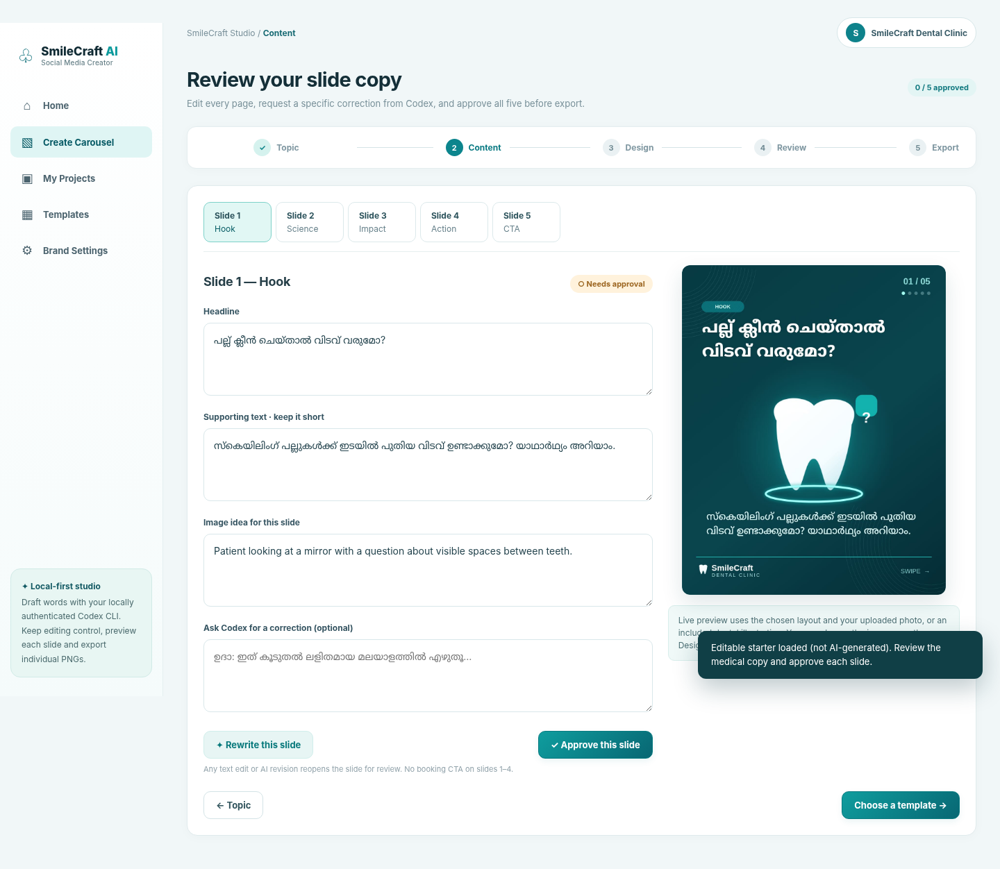
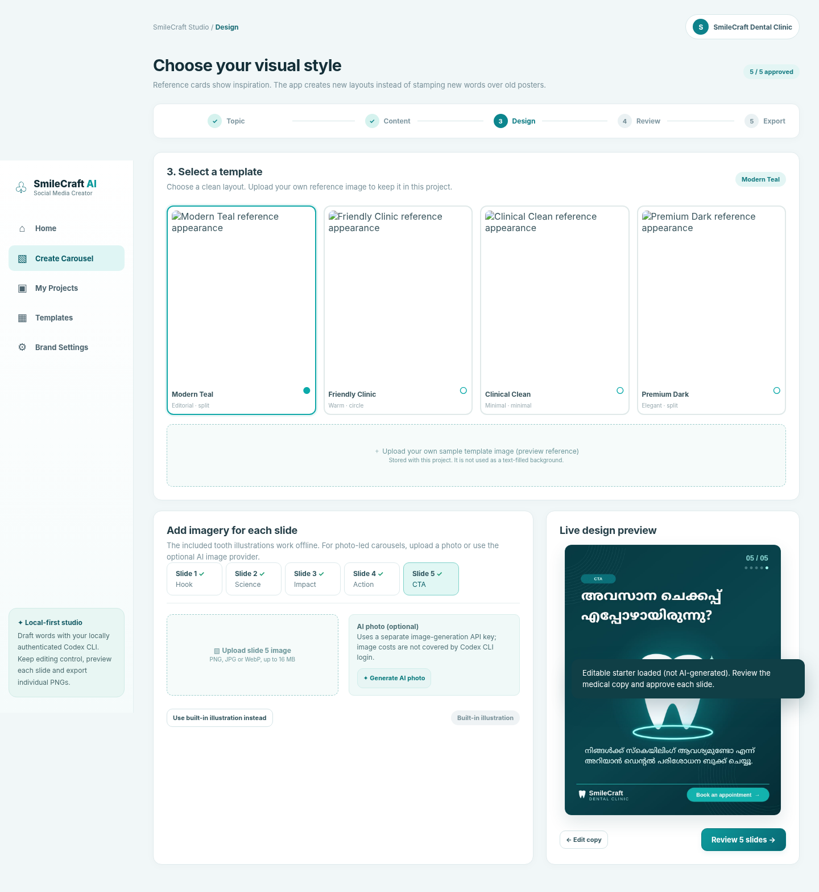
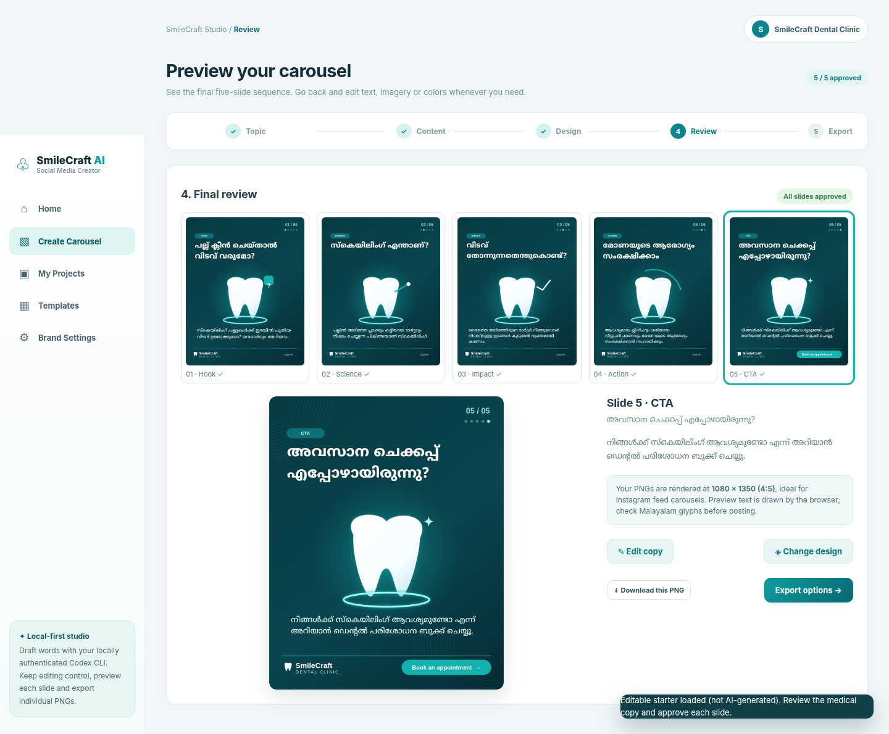
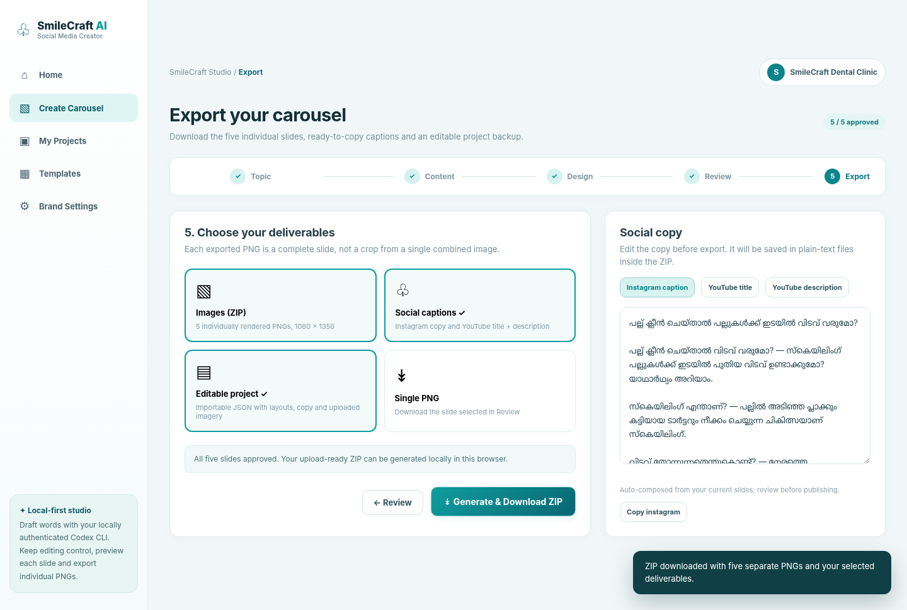

# Studio walkthrough

The captured screenshots use the built-in editable sample and vector illustration mode, so you can test the full application and generate carousels without connecting Codex or an image API.
